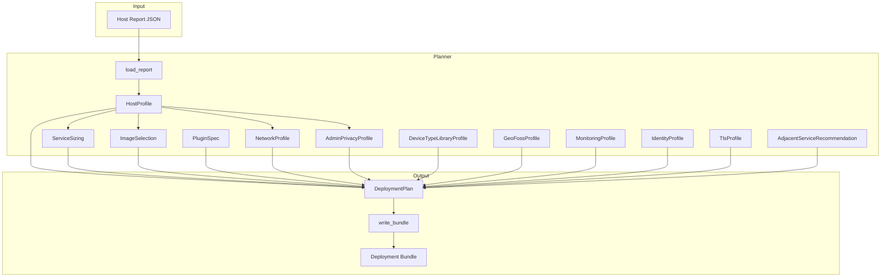
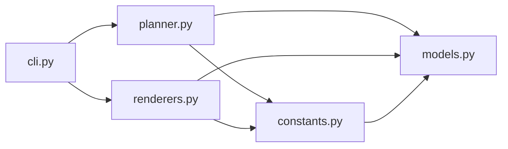

# Architecture

The NetBox Deployment Factory follows a **planner → renderer** pipeline architecture. This page describes the design decisions, component relationships, and data flow.

## Pipeline Overview

## Planner Module

The planner (`planner.py`) is responsible for:

1. **Loading the report** — Reads the JSON report produced by `ultimate_info_gather` via `load_report()`.
2. **Building the host profile** — Extracts OS, architecture, memory, CPU cores, Docker capability, and network information into a typed `HostProfile`.
3. **Deriving the service IP** — Selects the highest-bandwidth active RFC1918 interface, with an override via `--host-ip` or `NETBOX_DEPLOY_HOST_IP` environment variable.
4. **Deriving sizing** — Maps total host memory to a sizing profile (`small`, `medium`, or `large`) that controls worker counts and PostgreSQL tuning.
5. **Selecting plugins** — Deep-copies the `DEFAULT_PLUGIN_SPECS` tuple from `constants.py`, preserving the enabled/disabled state based on upstream compatibility metadata.
6. **Deriving network layout** — Computes six isolated Docker network segments in deterministic or dynamic CIDR mode.
7. **Deriving admin privacy** — Creates a pseudonymous bootstrap admin identity from a SHA-256 hash of the report ID.
8. **Deriving TLS profile** — Determines self-signed or Let's Encrypt mode based on `--fqdn` and `--acme-email` flags.
9. **Assembling the plan** — Combines all derived profiles into a single `DeploymentPlan` dataclass.

### Sizing Derivation Logic

The planner uses a simple memory-based sizing model:

| Profile | Total Memory | Workers | Worker Containers | Postgres shared_buffers | Max Connections | Housekeeping Interval |
|---------|-------------|---------|-------------------|------------------------|-----------------|----------------------|
| `small` | < 6 GiB | 1 | 1 | 256 MB | 200 | 30 min |
| `medium` | 6–12 GiB | 2 | 2 | 512 MB | 300 | 20 min |
| `large` | ≥ 12 GiB | 4 | 4 | 1 GB | 500 | 15 min |

The `--worker-containers` CLI flag overrides the derived container count.

### Service IP Selection

The planner selects the published host IP using this priority:

1. `--host-ip` CLI flag
2. `NETBOX_DEPLOY_HOST_IP` environment variable
3. Highest-bandwidth active RFC1918 interface from the report
4. Fallback to `127.0.0.1`

### Network CIDR Planning

Two modes are available:

- **Deterministic** (default) — Fixed /27 and /28 blocks from `172.30.0.0/24`.
- **Dynamic** — Segments are allocated from `172.31.0.0/16` with prefix lengths sized to the requested host count per segment.

## Renderer Module

The renderer (`renderers.py`) transforms a `DeploymentPlan` into the deployment bundle. Key responsibilities:

1. **Compose generation** — Produces a `docker-compose.yml` with all core, profiled, and init services.
2. **Dockerfile generation** — Creates `Dockerfile-Plugins` (custom NetBox image with plugins) and `Dockerfile-GeoFoss` (geo-foss sidecar).
3. **Configuration generation** — Renders Traefik dynamic config, WAF default config, ORB agent config, monitoring stack configs, and plugin Python configuration.
4. **Script generation** — Produces shell and Python scripts for superuser sync, device-type import, geo-foss import, Diode credential setup, Authentik bootstrap, TLS cert generation, and monitoring dashboard fetch.
5. **Environment files** — Creates `.env` files for each service group.
6. **Secret placeholders** — Generates `.example` files in the `secrets/` directory with a `.gitignore` preventing real secrets from being committed.
7. **Plan serialization** — Writes `deployment-plan.json` for audit and reproducibility.
8. **Summary README** — Generates a bundle-specific `README.md` summarizing the deployment.

### Conditional Rendering

The renderer conditionally emits artifacts based on the `DeploymentPlan`:

- **TLS mode** — Self-signed mode generates `scripts/generate-traefik-cert.sh` and the `traefik-certgen` init container. Let's Encrypt mode generates `secrets/cf_dns_api_token.example` instead, and configures ACME on Traefik routers.
- **Worker count** — Multiple worker containers are rendered as separate Compose services (`netbox-worker`, `netbox-worker-2`, etc.).
- **Public host** — URLs and allowed hosts are derived from the FQDN (Let's Encrypt mode), service IP, hostname, or `localhost` as a final fallback.

## Constants Module

The `constants.py` module centralizes all version pins and image references:

- `NETBOX_VERSION`, `NETBOX_IMAGE` — Core NetBox version and image tag
- `TRACK_IMAGE_DEFAULTS` — Per-track (alpine/debian) Postgres and Valkey image pins
- `DEFAULT_PLUGIN_SPECS` — Tuple of 11 `PluginSpec` dataclasses with compatibility metadata
- Diode, ORB, monitoring, identity, and library image/reference constants

All version pins are derived from this single module, ensuring consistency across the generated bundle.

## Module Relationships

| Module | Responsibility |
|--------|---------------|
| `cli.py` | Argument parsing, orchestration of planner → renderer pipeline |
| `planner.py` | Report parsing, profile derivation, plan assembly |
| `renderers.py` | Template rendering, file writing, bundle output |
| `constants.py` | Version pins, image references, plugin specifications |
| `models.py` | Typed dataclasses for all planning structures |
| `__main__.py` | Module execution entry point (`python -m netbox_deployment_factory`) |

## Standards Alignment

The factory aligns with these operational standards:

- **netbox-docker plugin workflow** — Uses `Dockerfile-Plugins` pattern with `uv pip install`, plugin configuration via `plugins.py`, and `collectstatic` at build time.
- **NetBox Labs operating model** — NetBox remains the central source of truth; plugins are additive; Diode provides reconciliation APIs.
- **Docker Compose conventions** — Health checks, dependency conditions, profiled services, and named networks.
- **Secret management** — Docker secrets (file-based), separated by concern, with `.example` placeholders and `.gitignore` protection.
