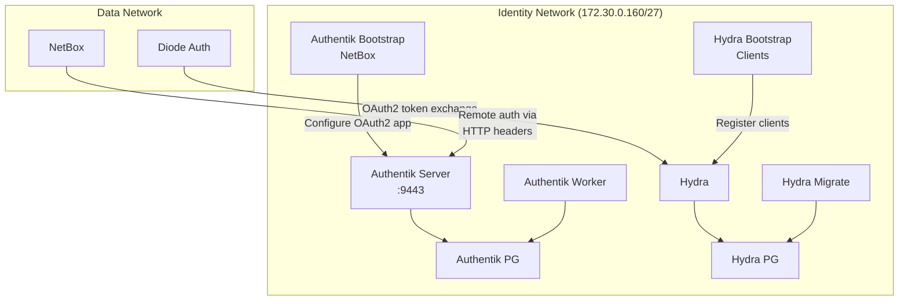

# Identity Stack

The generated bundle splits identity services between an **optional Authentik `identity` profile** for NetBox SSO and an **always-on Ory Hydra core stack** that Diode depends on for OAuth2 client-credentials grants.

## Components

| Service | Image | Lifecycle | Purpose |
|---------|-------|-----------|---------|
| Authentik server | `ghcr.io/goauthentik/server:2026.2.2` | `identity` profile | SSO/OIDC identity provider |
| Authentik worker | Same as server | `identity` profile | Background task worker |
| Authentik PostgreSQL | Track-dependent | `identity` profile | Dedicated database |
| Ory Hydra | `oryd/hydra:v2.3.0` | Core stack | OAuth2/OIDC server for Diode |
| Hydra PostgreSQL | Track-dependent | Core stack | Dedicated database |

## Architecture



## Authentik (SSO/OIDC)

Authentik provides user-facing SSO/OIDC identity for NetBox. It is available as an opt-in service under the `identity` Compose profile.

### What It Provides

- Single sign-on for NetBox via OIDC
- Remote authentication via HTTP headers (`HTTP_X_AUTHENTIK_USERNAME`, `HTTP_X_AUTHENTIK_EMAIL`)
- User auto-creation when authenticated via SSO
- Flexible authentication flows (MFA, passwordless, SAML)

### NetBox Remote Auth Configuration

The generated `configuration/extra.py` enables remote authentication:

```python
REMOTE_AUTH_ENABLED = True
REMOTE_AUTH_BACKEND = "netbox.authentication.RemoteUserBackend"
REMOTE_AUTH_HEADER = "HTTP_X_AUTHENTIK_USERNAME"
REMOTE_AUTH_USER_EMAIL = "HTTP_X_AUTHENTIK_EMAIL"
REMOTE_AUTH_AUTO_CREATE_USER = True
```

### Bootstrap Process

The `authentik-bootstrap-netbox` init container runs `scripts/authentik-bootstrap-netbox.sh` to configure NetBox as an OAuth2 application in the Authentik instance. This runs automatically on first stack start.

### Access

Authentik is available at **https://&lt;host-ip&gt;:9443** with the default `akadmin` credentials.

## Ory Hydra (OAuth2)

Ory Hydra provides the OAuth2/OIDC server required by `diode-auth` for client-credentials grants. Hydra services start with the default stack because diode-auth is coupled to the Hydra Admin API.

### What It Provides

- OAuth2 client-credentials grants for Diode authentication
- Automated client registration via init container

### Bootstrap Process

The `hydra-bootstrap-clients` init container automatically registers the Diode and NetBox-to-Diode OAuth2 clients on first start using inline Hydra CLI commands.

### Database Migration

The `hydra-migrate` init container runs Hydra database migrations before the main Hydra service starts.

## Starting the Authentik Profile

### Prerequisites

Populate the Authentik identity secrets before starting the optional profile:

```bash
cd secrets
openssl rand -hex 32 > authentik_secret_key
openssl rand -base64 24 | tr -d '\n' > authentik_pg_password
openssl rand -base64 24 | tr -d '\n' > hydra_pg_password
openssl rand -hex 32 > hydra_system_secret
cd ..
```

### Start

```bash
docker compose --profile identity up -d
```

Hydra and its database/migration/bootstrap services start with the default stack because `diode-auth` depends on them.

## Generated Artifacts

| File | Description |
|------|-------------|
| `configuration/extra.py` | NetBox remote-auth settings for Authentik SSO |
| `env/authentik.env` | Authentik environment variables |
| `env/hydra.env` | Ory Hydra environment variables |
| `scripts/authentik-bootstrap-netbox.sh` | Configures NetBox as an OAuth2 app in Authentik |
| `scripts/setup-diode-credential.sh` | Provisions Diode client credentials in Hydra |
| `secrets/authentik_secret_key.example` | Authentik secret key placeholder |
| `secrets/authentik_pg_password.example` | Authentik PostgreSQL password placeholder |
| `secrets/hydra_pg_password.example` | Hydra PostgreSQL password placeholder |
| `secrets/hydra_system_secret.example` | Hydra system secret placeholder |

## Network Isolation

The isolated `identity` network segment (`172.30.0.160/27` in deterministic mode) carries Hydra core services plus the optional Authentik profile. Diode services on the `data` network connect to Hydra through the `identity` network for OAuth2 token exchange.

## Compose Services

### Core Stack Services (always started)

| Service | Description |
|---------|-------------|
| `hydra` | OAuth2/OIDC server |
| `hydra-postgres` | Dedicated PostgreSQL for Hydra |
| `hydra-migrate` | Database migration init container |
| `hydra-bootstrap-clients` | OAuth2 client registration init container |

### Profile Services (opt-in via `identity`)

| Service | Description |
|---------|-------------|
| `authentik-server` | SSO/OIDC identity provider |
| `authentik-worker` | Background task worker |
| `authentik-postgres` | Dedicated PostgreSQL for Authentik |
| `authentik-bootstrap-netbox` | NetBox OAuth2 app configuration init container |
