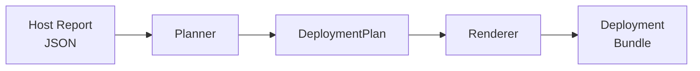

# NetBox Deployment Factory

The **NetBox Deployment Factory** is a subproject of Ultimate Info Gather that transforms JSON system reports into reproducible, production-ready NetBox deployment bundles.

!!! note "Execution paths"
    The factory can be run either through the Docker-local workflow documented in this section or through an installed subproject environment using `netbox-deployment-factory` / `python3 -m netbox_deployment_factory`. The root repository's `python3 -m src.deploy` command is a separate end-to-end pipeline.

## What It Does

The factory consumes a JSON report produced by `ultimate_info_gather` and generates a complete Docker Compose deployment bundle for NetBox 4.5.x. The bundle follows the official [netbox-docker](https://github.com/netbox-community/netbox-docker) plugin workflow and includes:

- A custom NetBox image with pinned plugins and migrations
- Traefik v3.6 reverse proxy with TLS termination
- OWASP ModSecurity CRS WAF sidecar
- PostgreSQL and Valkey (Redis-compatible) backends
- Diode auth, ingester, and reconciler services
- Optional sidecars for device-type import, geographic data, ORB discovery, monitoring, and identity



## Design Principles

- **NetBox as source of truth** — NetBox is treated as the central authoritative system for topology, IPAM, and network automation data.
- **Additive plugin model** — Plugins are configured only through `PLUGINS` and `PLUGINS_CONFIG`; core NetBox behavior is left untouched.
- **Strict compatibility gating** — Plugins are enabled only when upstream metadata confirms NetBox 4.5.x compatibility.
- **Pseudonymous bootstrap admin** — The initial superuser is not tied to a human identity; credentials exist only in Docker secret files.
- **Docker-localized CI/CD** — All linting, type checking, tests, and bundle generation run inside Docker Compose services.
- **Least privilege** — Secrets are separated, Linux capabilities are dropped, and container services use `no-new-privileges`.

## Quick Example

```bash
# Generate a host report
python3 main.py -o ./generated-report -f json

# Generate a deployment bundle (Debian track)
cd netbox_deployment_factory
docker compose -f docker-compose.ci.yml run --rm factory \
  --report /host-root/generated-report/report.json \
  --output-dir /workspace/generated/netbox-deploy \
  --host-ip 192.168.1.100 \
  --track debian \
  --deployment-name netbox-deploy
```

## Documentation Perspectives

This documentation is organized around multiple perspectives to serve different audiences:

<div class="grid cards" markdown>

-   :material-rocket-launch:{ .lg .middle } **[Quickstart](quickstart.md)**

    ---

    Step-by-step deployment walkthrough from report generation to running NetBox

-   :material-cog:{ .lg .middle } **[Architecture](architecture.md)**

    ---

    Design decisions, planner-renderer pipeline, and component relationships

-   :material-console:{ .lg .middle } **[CLI Reference](cli-reference.md)**

    ---

    Complete command-line flag reference with examples

-   :material-database:{ .lg .middle } **[Data Models](data-models.md)**

    ---

    Typed dataclass reference for the deployment planning pipeline

-   :material-puzzle:{ .lg .middle } **[Plugin Catalog](plugins.md)**

    ---

    All 11 plugin specifications with compatibility matrix and configuration

-   :material-lan:{ .lg .middle } **[Network Segmentation](networking.md)**

    ---

    Six isolated Docker networks with deterministic and dynamic CIDR modes

-   :material-lock:{ .lg .middle } **[TLS Termination](tls.md)**

    ---

    Self-signed and Let's Encrypt ACME certificate management

-   :material-shield:{ .lg .middle } **[Security & Privacy](security.md)**

    ---

    Privacy model, secrets management, and least-privilege architecture

-   :material-chart-line:{ .lg .middle } **[Monitoring Stack](monitoring.md)**

    ---

    Grafana, Prometheus, Loki, and full observability stack

-   :material-account-key:{ .lg .middle } **[Identity Stack](identity.md)**

    ---

    Authentik SSO/OIDC and Ory Hydra OAuth2 integration

-   :material-docker:{ .lg .middle } **[Sidecar Services](sidecars.md)**

    ---

    Device-type library, geographic data, ORB discovery, and Diode

-   :material-file-tree:{ .lg .middle } **[Generated Bundle](generated-bundle.md)**

    ---

    Complete listing of generated files, services, and profiles

-   :material-wrench:{ .lg .middle } **[Troubleshooting](troubleshooting.md)**

    ---

    Common issues, operational tips, and debugging procedures

</div>

## Version Pins

| Component | Version |
|-----------|---------|
| NetBox | `4.5.7` |
| netbox-docker workflow | `4.0.2` |
| Alpine reference | `3.23.3` |
| Debian reference | `13.3 (Trixie)` |
| Traefik | `v3.6.13` |
| WAF | `owasp/modsecurity-crs:4.25.0-nginx-lts` |
| Valkey | pinned per lifecycle track |

See the individual component pages for complete version pin tables.
