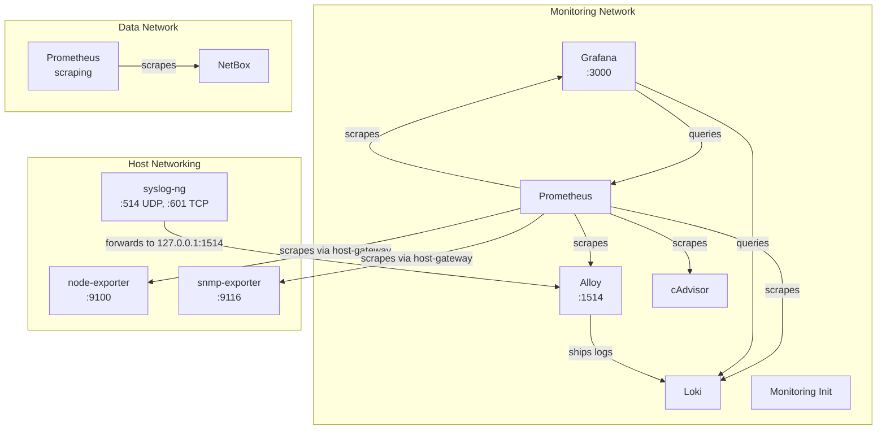

# Monitoring Stack

The generated bundle includes an optional monitoring stack based on [enter-the-metrics](https://github.com/nullroute-commits/enter-the-metrics), profiled under the `monitoring` Compose profile.

## Components

| Service | Image | Purpose |
|---------|-------|---------|
| Grafana | `grafana/grafana:12.4.2` | Dashboard visualization |
| Prometheus | `prom/prometheus:v3.11.0` | Metrics collection |
| Loki | `grafana/loki:3.7.1` | Log aggregation |
| Alloy | `grafana/alloy:v1.15.0` | Log shipping agent (syslog → Loki) |
| syslog-ng | `balabit/syslog-ng:4.11.0` | Syslog forwarding |
| node-exporter | `prom/node-exporter:v1.11.1` | Host system metrics (CPU, memory, network, disk) |
| snmp-exporter | `prom/snmp-exporter:v0.30.1` | SNMP device metrics |
| cAdvisor | `gcr.io/cadvisor/cadvisor:v0.52.1` | Docker container metrics |

Source repository: [enter-the-metrics](https://github.com/nullroute-commits/enter-the-metrics) pinned at commit `706ed92`.

## Starting the Stack

```bash
# Download Grafana dashboards (one-time)
./scripts/fetch-monitoring-dashboards.sh

# Start all monitoring services
docker compose --profile monitoring up -d
```

## Access Points

| Service | URL | Default Credentials |
|---------|-----|-------------------|
| Grafana | `http://<host-ip>:3000` | `admin` / `admin` |

!!! warning "Change Grafana Password"
    Change the default Grafana password on first login.

## Architecture



Grafana, Prometheus, Loki, Alloy, cAdvisor, and the monitoring-dashboard-init container run on the isolated `monitoring` Docker network. Prometheus also joins the `data` network so it can scrape metrics from NetBox stack services.

syslog-ng, node-exporter, and snmp-exporter use `network_mode: host` for direct host-level access. Prometheus reaches these host-networked services via `extra_hosts` entries that resolve to `host-gateway`.

## Generated Configuration Files

| File | Description |
|------|-------------|
| `configuration/monitoring/prometheus/prometheus.yml` | Prometheus scrape targets |
| `configuration/monitoring/loki/loki-config.yml` | Loki log aggregation |
| `configuration/monitoring/alloy/config.alloy` | Alloy log agent |
| `configuration/monitoring/syslog-ng/syslog-ng.conf` | syslog-ng forwarding |
| `configuration/monitoring/grafana/provisioning/datasources/prometheus.yml` | Grafana Prometheus datasource |
| `configuration/monitoring/grafana/provisioning/datasources/loki.yml` | Grafana Loki datasource |
| `configuration/monitoring/grafana/provisioning/dashboards/performance_overview.yml` | Dashboard provisioning |
| `env/monitoring.env` | Grafana environment variables |

## Grafana Dashboards

The `scripts/fetch-monitoring-dashboards.sh` script downloads five preconfigured performance overview dashboards from the pinned upstream repository:

- Docker containers dashboard
- Grafana self-monitoring dashboard
- Loki log overview dashboard
- Prometheus self-monitoring dashboard
- Node Exporter host metrics dashboard

These dashboards are stored in the generated Grafana dashboards directory and provisioned automatically via the Grafana dashboard provisioner.

## Prometheus Scrape Targets

The generated Prometheus configuration scrapes metrics from:

- Prometheus (self)
- Grafana
- Loki
- Alloy
- node-exporter (via `host-gateway` alias)
- snmp-exporter (via `host-gateway` alias)
- cAdvisor
- NetBox stack services (via the `data` network)

To add custom scrape targets, edit `configuration/monitoring/prometheus/prometheus.yml`.

## Syslog Forwarding

syslog-ng runs with `network_mode: host` so it can receive syslog messages directly on the host's network interfaces. To forward syslog messages to the monitoring stack:

1. Configure the source device to send syslogs to:
    - **UDP**: `<host-ip>:514`
    - **TCP**: `<host-ip>:601`
2. syslog-ng receives and forwards logs to Alloy at `127.0.0.1:1514`.
3. Alloy ships logs to Loki for aggregation.
4. Logs are queryable in Grafana via the Loki datasource.

Alloy publishes port 1514 on `<host-ip>` and `127.0.0.1` so syslog-ng (host networking) can forward to it via loopback.

## SNMP Monitoring

To add SNMP monitoring targets:

1. Edit `configuration/monitoring/prometheus/prometheus.yml` to add SNMP scrape targets.
2. Set the appropriate community string in the snmp-exporter configuration.
3. Restart Prometheus: `docker compose --profile monitoring restart prometheus`
