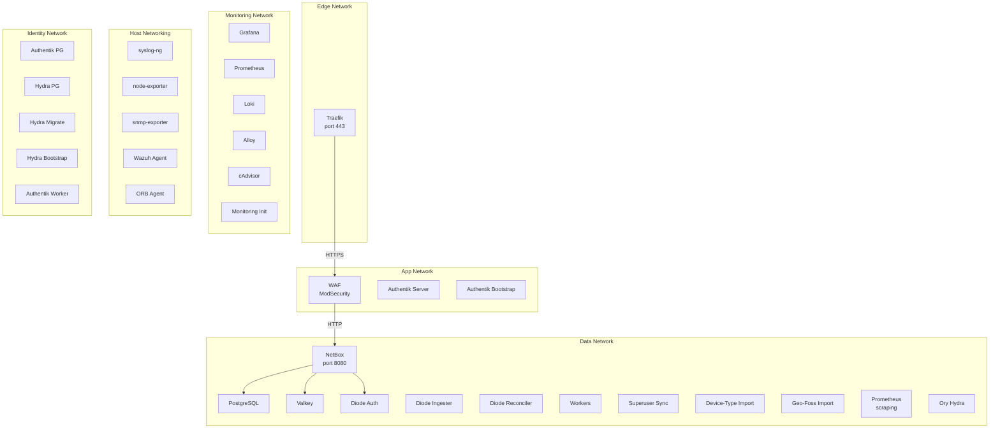

# Network Segmentation

The generated deployment uses six isolated Docker bridge networks with explicit CIDR allocations. This page documents the network topology, segment purposes, and CIDR planning modes.

## Network Topology



## Segment Allocations

| Network | Purpose | Deterministic CIDR | Services |
|---------|---------|-------------------|----------|
| `edge` | TLS termination | `172.30.0.0/27` | Traefik |
| `app` | Application layer | `172.30.0.32/27` | Traefik, WAF, Authentik server, Authentik bootstrap |
| `data` | Data plane | `172.30.0.64/27` | WAF, NetBox, PostgreSQL, Valkey, Diode, workers, imports, Prometheus, Hydra |
| `security` | Security observability | `172.30.0.96/28` | *(reserved; Wazuh uses host networking)* |
| `monitoring` | Monitoring stack | `172.30.0.128/27` | Grafana, Prometheus, Loki, Alloy, cAdvisor, monitoring-dashboard-init |
| `identity` | Identity providers | `172.30.0.160/27` | Traefik, Authentik, Ory Hydra, Diode auth, dedicated PostgreSQL instances |

## CIDR Planning Modes

### Deterministic Mode (Default)

Uses fixed CIDR blocks from `172.30.0.0/24`. This mode is predictable and requires no special sizing configuration.

```bash
python -m netbox_deployment_factory \
  --report report.json \
  --output-dir ./deploy \
  --cidr-mode deterministic
```

### Dynamic Mode

Allocates segments from `172.31.0.0/16` with prefix lengths calculated from the requested host count per segment. The allocation algorithm:

1. Starts at `172.31.0.0`.
2. For each segment, calculates the minimum prefix length to accommodate the requested host count.
3. Aligns the cursor to the block boundary.
4. Allocates the block and advances the cursor.

```bash
python -m netbox_deployment_factory \
  --report report.json \
  --output-dir ./deploy \
  --cidr-mode dynamic \
  --edge-hosts 60 \
  --app-hosts 30 \
  --data-hosts 12 \
  --security-hosts 8
```

!!! note "Monitoring and identity segments"
    The monitoring and identity segments each default to 16 required hosts and are allocated automatically in both modes.

## Service Network Membership

The following table shows which networks each service connects to:

| Service | edge | app | data | monitoring | identity | Host networking |
|---------|------|-----|------|------------|----------|-----------------|
| Traefik | ✅ | ✅ | | | ✅ | |
| WAF | | ✅ | ✅ | | | |
| NetBox | | | ✅ | | | |
| PostgreSQL | | | ✅ | | | |
| Valkey | | | ✅ | | | |
| Workers | | | ✅ | | | |
| Diode auth | | | ✅ | | ✅ | |
| Diode ingester | | | ✅ | | | |
| Diode reconciler | | | ✅ | | | |
| Superuser sync | | | ✅ | | | |
| Diode credential setup | | | ✅ | | | |
| Device-type import | | | ✅ | | | |
| Geo-foss import | | | ✅ | | | |
| Wazuh agent | | | | | | ✅ |
| ORB agent | | | | | | ✅ |
| Grafana | | | | ✅ | | |
| Prometheus | | | ✅ | ✅ | | |
| Loki | | | | ✅ | | |
| Alloy | | | | ✅ | | |
| syslog-ng | | | | | | ✅ |
| node-exporter | | | | | | ✅ |
| snmp-exporter | | | | | | ✅ |
| cAdvisor | | | | ✅ | | |
| Monitoring init | | | | ✅ | | |
| Authentik server | | ✅ | | | ✅ | |
| Authentik worker | | | | | ✅ | |
| Authentik PostgreSQL | | | | | ✅ | |
| Authentik bootstrap | | ✅ | | | ✅ | |
| Ory Hydra | | | ✅ | | ✅ | |
| Hydra PostgreSQL | | | | | ✅ | |
| Hydra migrate | | | | | ✅ | |
| Hydra bootstrap clients | | | | | ✅ | |

!!! note "Cross-network services"
    - **Traefik** bridges `edge`, `app`, and `identity` to route traffic to the WAF and enable Authentik forward-auth.
    - **WAF** bridges `app` and `data` to forward validated traffic from Traefik to NetBox.
    - **Prometheus** bridges `monitoring` and `data` to scrape metrics from NetBox stack services.
    - **Diode auth** bridges `data` and `identity` so diode services can reach Hydra for OAuth2 token exchange.
    - **Ory Hydra** bridges `identity` and `data` for Diode OAuth2 integration.
    - **Authentik server** and **Authentik bootstrap** bridge `identity` and `app` for SSO forward-auth with Traefik.

!!! note "Host-networked services"
    The following services use `network_mode: host` and are not attached to any Docker bridge network: **syslog-ng**, **node-exporter**, **snmp-exporter**, **Wazuh agent**, and **ORB agent**. These services require direct host access for system-level metrics, syslog reception, or network discovery.

## Security Properties

- **Port exposure**: Traefik publishes port 443 (always) and port 80 (Let's Encrypt mode). The monitoring profile publishes Grafana on port 3000 and Alloy on port 1514. Diode auth binds to `127.0.0.1:18080`. Host-networked services (syslog-ng, node-exporter, snmp-exporter, Wazuh, ORB) expose their native ports directly on the host.
- **Isolation**: Each network segment is an isolated Docker bridge network. Services cannot communicate across segments unless explicitly attached to multiple networks.
- **Capability dropping**: NetBox application services drop all Linux capabilities and enable `no-new-privileges`.
