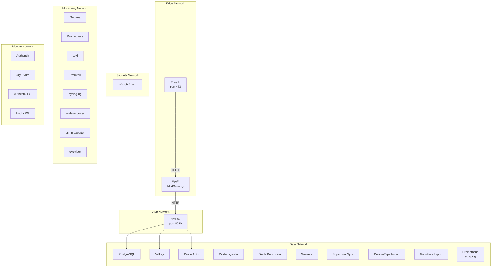

# Network Segmentation

The generated deployment uses six isolated Docker bridge networks with explicit CIDR allocations. This page documents the network topology, segment purposes, and CIDR planning modes.

## Network Topology



## Segment Allocations

| Network | Purpose | Deterministic CIDR | Services |
|---------|---------|-------------------|----------|
| `edge` | TLS termination and WAF | `172.30.0.0/27` | Traefik, WAF |
| `app` | Application layer | `172.30.0.32/27` | WAF, NetBox |
| `data` | Data plane | `172.30.0.64/27` | NetBox, PostgreSQL, Valkey, Diode, workers, imports, Prometheus |
| `security` | Security observability | `172.30.0.96/28` | Wazuh agent |
| `monitoring` | Monitoring stack | `172.30.0.128/27` | Grafana, Prometheus, Loki, Promtail, syslog-ng, exporters, cAdvisor |
| `identity` | Identity providers | `172.30.0.160/27` | Authentik, Ory Hydra, dedicated PostgreSQL instances |

## CIDR Planning Modes

### Deterministic Mode (Default)

Uses fixed CIDR blocks from `172.30.0.0/24`. This mode is predictable and requires no special sizing configuration.

```bash
python -m netbox_deployment_factory \
  --report report.json \
  --output-dir ./deploy \
  --cidr-mode deterministic
```

### Dynamic Mode

Allocates segments from `172.31.0.0/16` with prefix lengths calculated from the requested host count per segment. The allocation algorithm:

1. Starts at `172.31.0.0`.
2. For each segment, calculates the minimum prefix length to accommodate the requested host count.
3. Aligns the cursor to the block boundary.
4. Allocates the block and advances the cursor.

```bash
python -m netbox_deployment_factory \
  --report report.json \
  --output-dir ./deploy \
  --cidr-mode dynamic \
  --edge-hosts 60 \
  --app-hosts 30 \
  --data-hosts 12 \
  --security-hosts 8
```

!!! note "Monitoring and identity segments"
    The monitoring and identity segments each default to 16 required hosts and are allocated automatically in both modes.

## Service Network Membership

The following table shows which networks each service connects to:

| Service | edge | app | data | security | monitoring | identity |
|---------|------|-----|------|----------|------------|----------|
| Traefik | ✅ | | | | | |
| WAF | ✅ | ✅ | | | | |
| NetBox | | ✅ | ✅ | | | |
| PostgreSQL | | | ✅ | | | |
| Valkey | | | ✅ | | | |
| Workers | | | ✅ | | | |
| Diode auth | | | ✅ | | | ✅ |
| Diode ingester | | | ✅ | | | |
| Diode reconciler | | | ✅ | | | |
| Superuser sync | | | ✅ | | | |
| Device-type import | | | ✅ | | | |
| Geo-foss import | | | ✅ | | | |
| Wazuh agent | | | | ✅ | | |
| Grafana | | | | | ✅ | |
| Prometheus | | | ✅ | | ✅ | |
| Loki | | | | | ✅ | |
| Promtail | | | | | ✅ | |
| syslog-ng | | | | | ✅ | |
| node-exporter | | | | | ✅ | |
| snmp-exporter | | | | | ✅ | |
| cAdvisor | | | | | ✅ | |
| Authentik | | | | | | ✅ |
| Ory Hydra | | | | | | ✅ |

!!! note "Cross-network services"
    - **WAF** bridges `edge` and `app` to forward validated traffic from Traefik to NetBox.
    - **Prometheus** bridges `monitoring` and `data` to scrape metrics from NetBox stack services.
    - **Diode auth** bridges `data` and `identity` so diode services can reach Hydra for OAuth2 token exchange.

## Security Properties

- **Port exposure**: Only Traefik has published host ports (443 always; 80 added in Let's Encrypt mode for HTTP→HTTPS redirect).
- **Isolation**: Each network segment is an isolated Docker bridge network. Services cannot communicate across segments unless explicitly attached to multiple networks.
- **Capability dropping**: NetBox application services drop all Linux capabilities and enable `no-new-privileges`.
