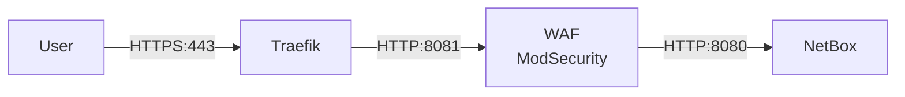

# TLS Termination

The generated bundle supports two TLS termination modes for the Traefik reverse proxy. The mode is determined at plan time based on the `--fqdn` and `--acme-email` CLI flags.

## Mode Comparison

| Feature | Self-Signed (default) | Let's Encrypt ACME |
|---------|----------------------|-------------------|
| Certificate type | Auto-generated self-signed | Trusted CA certificate |
| External dependencies | None | Cloudflare DNS zone |
| Published ports | 443 only | 443 + 80 (HTTP→HTTPS redirect) |
| Certificate storage | `traefik-certs` Docker volume | `acme-data` Docker volume |
| Certificate renewal | Manual (regenerate) | Automatic |
| CLI flags required | None | `--fqdn`, `--acme-email` |
| Best for | Development, lab, air-gapped | Production |

## Self-Signed Mode (Default)

When no `--fqdn` is provided, the factory generates a `traefik-certgen` init container and a `scripts/generate-traefik-cert.sh` script that creates a self-signed certificate.

### How It Works

1. On first `docker compose up -d`, the `traefik-certgen` init container runs before Traefik starts.
2. The script generates a self-signed certificate with SAN entries for:
    - The host IP (from `--host-ip` or auto-detected)
    - `localhost`
    - `127.0.0.1`
    - `traefik`
    - `netbox`
    - The system hostname (if it passes validation)
3. The certificate is stored in the `traefik-certs` Docker volume.
4. `configuration/traefik/dynamic.yml` references the certificate files statically.

### Generated Artifacts

- `scripts/generate-traefik-cert.sh` — Certificate generation script
- `configuration/traefik/dynamic.yml` — Static certificate references

### Custom Certificates

To use CA-signed certificates in self-signed mode, replace the files in the `traefik-certs` volume:

```bash
docker volume inspect <deployment-name>_traefik-certs
# Copy tls.crt and tls.key into the volume mount point
```

## Let's Encrypt ACME Mode

When the factory is invoked with `--fqdn` and `--acme-email`, the generated bundle switches to automated certificate management via Let's Encrypt.

### How It Works

1. Traefik is configured with ACME DNS-01 challenge using the Cloudflare provider.
2. On first start, Traefik requests a certificate from Let's Encrypt.
3. The Cloudflare API token (from Docker secret `cf_dns_api_token`) is used to create DNS TXT records for domain validation.
4. The ACME account key and certificates are persisted in the `acme-data` Docker volume.
5. Certificate renewal is automatic.

### Prerequisites

1. A Cloudflare-managed DNS zone for the FQDN.
2. A Cloudflare API token with `Zone:DNS:Edit` permission scoped to the zone.
3. A DNS A/AAAA record pointing the FQDN to the deployment host (or a wildcard record).

### Setup

```bash
cd generated/netbox-deploy/secrets
echo -n 'your-cloudflare-dns-api-token' > cf_dns_api_token
cd ..
docker compose up -d
```

### Generated Artifacts

- `secrets/cf_dns_api_token.example` — Cloudflare API token placeholder
- `configuration/traefik/dynamic.yml` — Uses `certResolver: letsencrypt` on routers with the FQDN as the main domain

### Changes Relative to Self-Signed Mode

- The `traefik-certgen` init container and `traefik-certs` volume are removed.
- Traefik is configured with `--certificatesresolvers.letsencrypt.acme.dnschallenge.provider=cloudflare` and the registration email.
- Port 80 is published with an HTTP→HTTPS redirect entrypoint.
- An `acme-data` volume persists the ACME account and certificates.
- The Cloudflare DNS API token is read from Docker secret `cf_dns_api_token`.
- `env/netbox.env` adds the FQDN to `ALLOWED_HOSTS` and `CSRF_TRUSTED_ORIGINS`.

## Traefik Reverse Proxy

The Traefik v3.6 reverse proxy sits at the edge of the deployment:

- Listens on port 443 with TLS termination.
- Routes all HTTPS traffic to the WAF sidecar via the dynamic configuration in `configuration/traefik/dynamic.yml`.
- Enables gzip compression middleware for responses.
- The API dashboard is disabled; only the `/ping` healthcheck endpoint is active.
- Traefik is the only service with a published host port.

## WAF Sidecar

An OWASP ModSecurity Core Rule Set (CRS) WAF runs as an nginx-based sidecar between Traefik and NetBox:

| Property | Value |
|----------|-------|
| Image | `owasp/modsecurity-crs:4.25.0-nginx-lts` |
| Internal port | 8081 |
| Upstream | `http://netbox:8080` |
| Networks | `app`, `data` |

The WAF sets `X-Forwarded-Proto`, `X-Forwarded-Host`, and `X-Forwarded-Port` headers so NetBox sees the correct external origin.

## Traffic Flow



All traffic from external users enters through Traefik (TLS termination), passes through the WAF (security inspection), and reaches NetBox (application).
