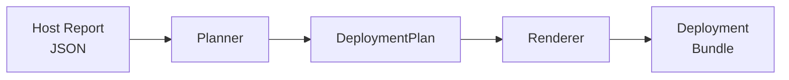

# NetBox Deployment Factory

!!! tip "Comprehensive Documentation Available"
    This page provides a single-page reference for the deployment factory. For comprehensive, multiperspective documentation organized by topic, see the **[Deployment Factory docs section](../factory/index.md)**, which includes dedicated pages for [quickstart](../factory/quickstart.md), [architecture](../factory/architecture.md), [CLI reference](../factory/cli-reference.md), [plugin catalog](../factory/plugins.md), [network segmentation](../factory/networking.md), [TLS termination](../factory/tls.md), [security & privacy](../factory/security.md), [monitoring](../factory/monitoring.md), [identity](../factory/identity.md), [sidecar services](../factory/sidecars.md), [generated bundle](../factory/generated-bundle.md), and [troubleshooting](../factory/troubleshooting.md).

The `netbox_deployment_factory` subproject consumes JSON reports produced by Ultimate Info Gather and generates reproducible NetBox deployment bundles following current NetBox Labs and official netbox-docker practices.

## Overview

The factory operates as a **planner → renderer** pipeline:

1. A host report (JSON) is loaded and parsed into a typed `HostProfile`.
2. The planner derives sizing, plugin selection, network layout, TLS mode, and other deployment decisions.
3. The renderer emits a complete deployment bundle: Docker Compose file, Dockerfiles, environment files, configuration files, scripts, and secret placeholders.

## Version Pins

| Component | Version |
|-----------|---------|
| NetBox | `4.5.4` |
| netbox-docker workflow | `4.0.1` |
| Alpine reference | `3.23.3` |
| Debian reference | `13.3 (Trixie)` |
| Traefik | `v3.2` |
| WAF | `owasp/modsecurity-crs:4.6.0-nginx` |
| Valkey | pinned per lifecycle track |
| Diode auth | `netboxlabs/diode-auth:1.12.0` |
| Diode ingester | `netboxlabs/diode-ingester:1.13.0` |
| Diode reconciler | `netboxlabs/diode-reconciler:1.13.0` |
| ORB agent | `netboxlabs/orb-agent:2.7.0` |
| Authentik | `ghcr.io/goauthentik/server:2026.2.1` |
| Ory Hydra | `oryd/hydra:v2.2.0` |
| Grafana | `grafana/grafana:12.4.2` |
| Prometheus | `prom/prometheus:v3.11.0` |
| Loki | `grafana/loki:3.7.1` |
| Alloy | `grafana/alloy:v1.15.0` |
| syslog-ng | `balabit/syslog-ng:4.11.0` |
| node-exporter | `prom/node-exporter:v1.11.1` |
| snmp-exporter | `prom/snmp-exporter:v0.30.1` |
| cAdvisor | `gcr.io/cadvisor/cadvisor:v0.52.1` |

## CLI Options

The factory CLI is invoked via `python -m netbox_deployment_factory` or through the Docker CI workflow.

| Flag | Default | Description |
|------|---------|-------------|
| `--report` | *(required)* | Path to the JSON report |
| `--output-dir` | *(required)* | Directory for the deployment bundle |
| `--track` | `debian` | Image lifecycle track (`alpine` or `debian`) |
| `--deployment-name` | `netbox-stack` | Logical deployment name |
| `--cidr-mode` | `deterministic` | Docker network CIDR mode (`deterministic` or `dynamic`) |
| `--edge-hosts` | `16` | Host capacity for the edge network (dynamic mode) |
| `--app-hosts` | `16` | Host capacity for the app network (dynamic mode) |
| `--data-hosts` | `16` | Host capacity for the data network (dynamic mode) |
| `--security-hosts` | `8` | Host capacity for the security network (dynamic mode) |
| `--worker-containers` | *(auto)* | Override the number of NetBox worker containers |
| `--host-ip` | *(auto-detected)* | Override the published host IP |
| `--fqdn` | *(none)* | FQDN for Let's Encrypt ACME TLS (requires `--acme-email`) |
| `--acme-email` | *(none)* | Email for ACME registration (required with `--fqdn`) |

## Data Models

The planner produces a `DeploymentPlan` composed of typed dataclasses:

| Model | Purpose |
|-------|---------|
| `HostProfile` | Host capabilities (OS, architecture, memory, cores, Docker, service IP) |
| `ServiceSizing` | Worker count, Postgres tuning, housekeeping interval |
| `ImageSelection` | Pinned NetBox, Postgres, and Valkey images per lifecycle track |
| `PluginSpec` | Plugin package, module, version, compatibility tier, and config |
| `NetworkProfile` | CIDR mode and segment allocations |
| `NetworkSegment` | Individual network name, CIDR, and required host count |
| `AdminPrivacyProfile` | Pseudonymous bootstrap admin and secret file list |
| `DeviceTypeLibraryProfile` | Pinned library repository, ref, and least-privilege permissions |
| `GeoFossProfile` | Geographic data sidecar repository and ref |
| `MonitoringProfile` | Monitoring stack images and repository ref |
| `IdentityProfile` | Authentik and Ory Hydra image pins |
| `TlsProfile` | TLS mode (`self_signed` or `letsencrypt`), FQDN, ACME settings |
| `AdjacentServiceRecommendation` | Recommended adjacent FOSS services |
| `DeploymentPlan` | Aggregate of all the above plus warnings and notes |

## Sizing Profiles

The planner derives a sizing profile from the host's total memory:

| Profile | Memory Threshold | Workers | Worker Containers | Postgres shared_buffers | Max Connections |
|---------|-----------------|---------|-------------------|------------------------|-----------------|
| `small` | < 6 GiB | 1 | 1 | 256 MB | 200 |
| `medium` | 6–12 GiB | 2 | 2 | 512 MB | 300 |
| `large` | ≥ 12 GiB | 4 | 4 | 1 GB | 500 |

The `--worker-containers` CLI flag overrides the derived count.

## Plugin Catalog

The factory includes 11 plugin specifications with explicit compatibility metadata:

| Plugin | Version | Enabled | Support Tier | Compatibility |
|--------|---------|---------|-------------|---------------|
| `netbox-topology-views` | 4.5.0 | ✅ | supported-community | NetBox 4.5.x |
| `netbox-bgp` | 0.18.0 | ✅ | supported-community | NetBox 4.5.x |
| `netbox-plugin-dns` | 1.5.3 | ✅ | supported-community | min_version='4.5.0' |
| `netbox-acls` | 1.9.1 | ❌ | supported-community | max_version='4.4.99' |
| `netbox-reorder-rack` | 1.1.4 | ✅ | community | >=4.0.0 |
| `netbox-prometheus-sd` | 0.5 | ❌ | community-legacy | Legacy API, fails on 4.5.x |
| `netboxlabs-diode-netbox-plugin` | 1.7.1 | ✅ | supported-netboxlabs | min='4.4.10', max='4.5.99' |
| `netbox-proxbox` | 0.0.6b2 | ❌ | community-beta | max_version='4.2.99' |
| `netbox-config-diff` | 2.14.0 | ✅ | community | min='4.5.0', max='4.5.99' |
| `netbox-floorplan-plugin` | 0.9.0 | ✅ | community | min='4.5.0-beta1', max='4.5.99' |
| `netbox-inventory` | 2.5.0 | ✅ | community | min='4.5.0' |

Disabled plugins are included in the spec list for documentation but are not installed in the generated image.

## Network Architecture

The deployment uses six isolated Docker bridge networks with explicit CIDR allocations:

| Network | Purpose | Deterministic CIDR |
|---------|---------|-------------------|
| `edge` | Traefik ↔ WAF | `172.30.0.0/27` |
| `app` | WAF ↔ NetBox | `172.30.0.32/27` |
| `data` | NetBox, Postgres, Valkey, Diode, workers, imports | `172.30.0.64/27` |
| `security` | Wazuh agent | `172.30.0.96/28` |
| `monitoring` | Grafana, Prometheus, Loki, Alloy, syslog-ng, exporters | `172.30.0.128/27` |
| `identity` | Authentik, Ory Hydra, dedicated Postgres instances | `172.30.0.160/27` |

In `deterministic` mode (default), fixed blocks from `172.30.0.0/24` are used. In `dynamic` mode, segments are allocated from `172.31.0.0/16` with prefix lengths sized to the required host count.

## TLS Termination

Two modes are supported:

### Self-Signed (default)

A `traefik-certgen` init container generates a self-signed certificate with SAN entries for the host IP, localhost, and internal service names. The certificate is stored in a `traefik-certs` Docker volume.

### Let's Encrypt ACME

When `--fqdn` and `--acme-email` are provided, Traefik is configured with ACME DNS-01 challenge via Cloudflare. Port 80 is published for HTTP→HTTPS redirect, and an `acme-data` volume persists the ACME account and certificates.

## Generated Bundle

The renderer produces the following files:

### Core Files

- `docker-compose.yml` — full stack with all services and profiles
- `Dockerfile-Plugins` — custom NetBox image with plugin requirements
- `Dockerfile-GeoFoss` — local build of the geo-foss import sidecar
- `plugin_requirements.txt` — pinned plugin packages
- `deployment-plan.json` — serialized deployment plan
- `README.md` — bundle-specific documentation

### Configuration

- `configuration/plugins.py` — NetBox `PLUGINS` and `PLUGINS_CONFIG`
- `configuration/extra.py` — NetBox remote-auth settings for Authentik SSO
- `configuration/traefik/dynamic.yml` — Traefik TLS and routing
- `configuration/waf/default.conf` — OWASP ModSecurity CRS nginx config
- `configuration/orb/agent.yaml` — ORB agent configuration
- `configuration/monitoring/prometheus/prometheus.yml` — Prometheus scrape config
- `configuration/monitoring/loki/loki-config.yml` — Loki log aggregation
- `configuration/monitoring/alloy/config.alloy` — Alloy log agent
- `configuration/monitoring/syslog-ng/syslog-ng.conf` — syslog-ng forwarding
- `configuration/monitoring/grafana/provisioning/datasources/prometheus.yml`
- `configuration/monitoring/grafana/provisioning/datasources/loki.yml`
- `configuration/monitoring/grafana/provisioning/dashboards/performance_overview.yml`

### Environment Files

- `env/netbox.env` — NetBox application settings
- `env/postgres.env` — PostgreSQL configuration
- `env/diode.env` — Diode service settings (contains `replace-me` placeholders)
- `env/orb.env` — ORB agent settings
- `env/device-type-library-import.env` — Library import settings
- `env/geo-foss.env` — Geographic data import settings
- `env/monitoring.env` — Grafana environment variables
- `env/authentik.env` — Authentik identity provider settings
- `env/hydra.env` — Ory Hydra OAuth2 server settings

### Scripts

- `scripts/sync-superuser.sh` — creates bootstrap superuser and writes v2 API token
- `scripts/run-device-type-library-import.sh` — device-type library import runner
- `scripts/import-device-type-library.py` — REST API importer for device types
- `scripts/run-diode-ingester.sh` — Diode ingester entrypoint
- `scripts/run-diode-reconciler.sh` — Diode reconciler entrypoint
- `scripts/setup-diode-credential.sh` — provisions Diode OAuth2 client credentials
- `scripts/run-geo-foss-import.sh` — geographic data import runner
- `scripts/import-geo-data.py` — pynetbox-based geographic region import
- `scripts/fetch-monitoring-dashboards.sh` — downloads Grafana dashboards
- `scripts/authentik-bootstrap-netbox.sh` — configures NetBox in Authentik
- `scripts/generate-traefik-cert.sh` — self-signed TLS cert (self-signed mode only)

### Secrets

- `secrets/*.example` — placeholder files for all required secrets
- `secrets/cf_dns_api_token.example` — Cloudflare API token (Let's Encrypt mode only)
- `secrets/.gitignore` — prevents real secrets from being committed

## Compose Services

The generated `docker-compose.yml` defines the following services:

### Core Stack (always started)

| Service | Description |
|---------|-------------|
| `traefik` | TLS reverse proxy (port 443) |
| `waf` | OWASP ModSecurity CRS nginx sidecar |
| `postgres` | PostgreSQL database |
| `valkey` | Valkey cache and task queue (replaces Redis) |
| `netbox` | NetBox application |
| `netbox-worker` | NetBox RQ worker containers |
| `netbox-superuser-sync` | Bootstrap superuser creation and token minting |
| `diode-auth` | Diode authentication service |
| `diode-ingester` | Diode ingestion service |
| `diode-reconciler` | Diode reconciliation service |
| `diode-credential-setup` | Diode OAuth2 credential provisioning |
| `wazuh-agent` | Security observability agent |

### Profiled Services (opt-in)

| Service | Profile | Description |
|---------|---------|-------------|
| `device-type-library-import` | `device-type-library-import` | One-shot device-type library import |
| `netbox-geo-foss` | `geo-foss-import` | Geographic data import sidecar |
| `orb-agent` | `orb-discovery` | ORB network discovery agent |
| `grafana` | `monitoring` | Dashboard visualization |
| `prometheus` | `monitoring` | Metrics collection |
| `loki` | `monitoring` | Log aggregation |
| `alloy` | `monitoring` | Log shipping agent (syslog → Loki) |
| `syslog-ng` | `monitoring` | Syslog forwarding |
| `node-exporter` | `monitoring` | Host system metrics |
| `snmp-exporter` | `monitoring` | SNMP device metrics |
| `cadvisor` | `monitoring` | Container metrics |
| `monitoring-dashboard-init` | `monitoring` | Grafana dashboard provisioning |
| `authentik-server` | `identity` | SSO/OIDC identity provider |
| `authentik-worker` | `identity` | Authentik background worker |
| `authentik-postgres` | `identity` | Dedicated Postgres for Authentik |
| `authentik-bootstrap-netbox` | `identity` | NetBox OAuth2 app configuration |
| `hydra` | `identity` | OAuth2/OIDC server for Diode |
| `hydra-postgres` | `identity` | Dedicated Postgres for Hydra |
| `hydra-migrate` | `identity` | Hydra database migration |
| `hydra-bootstrap-clients` | `identity` | Diode OAuth2 client provisioning |

## Privacy Model

The deployment uses a pseudonymous bootstrap admin identity:

- Username is a `bootstrap-<hash>` alias derived from the source report ID.
- Email uses the reserved `.invalid` domain.
- Credentials exist only in local Docker secret files.
- The superuser-sync service writes the full v2 API token (`nbt_<key>.<plaintext>`) to a `token-store` volume for sidecar consumption.
- Database, admin, Diode, and identity secrets are separated into distinct files.
- The bootstrap account is intended only for first login, RBAC setup, and immediate rotation.

See [`netbox_deployment_factory/docs/PRIVACY.md`](../../netbox_deployment_factory/docs/PRIVACY.md) for the full privacy model.

## Adjacent Services

The plan includes guidance-only recommendations for complementary FOSS services:

| Category | Primary | Alternatives |
|----------|---------|-------------|
| Identity provider | Authentik | Keycloak, ZITADEL, Authelia |
| Password service | Vaultwarden | Passbolt |
| Link service | Linkding | Shlink |
| Cloud service | Nextcloud | Seafile |

These are not included in the generated Compose bundle. Deploy them adjacent to the NetBox stack behind the same reverse proxy.

## Further Reading

- [netbox_deployment_factory/README.md](../../netbox_deployment_factory/README.md) — full deployment walkthrough and operational details
- [netbox_deployment_factory/docs/FEATURE_ALIGNMENT.md](../../netbox_deployment_factory/docs/FEATURE_ALIGNMENT.md) — plugin compatibility evidence and feature rationale
- [netbox_deployment_factory/docs/IMPLEMENTATION_PLAN.md](../../netbox_deployment_factory/docs/IMPLEMENTATION_PLAN.md) — execution plan and feature mapping
- [netbox_deployment_factory/docs/PRIVACY.md](../../netbox_deployment_factory/docs/PRIVACY.md) — bootstrap admin privacy controls
