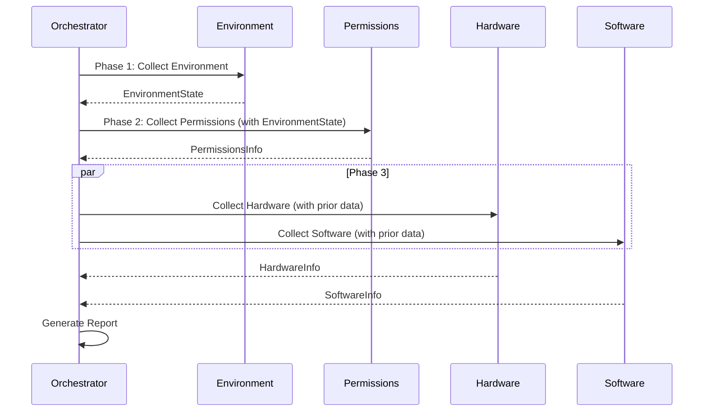

# Overview

Ultimate Info Gather is designed around a modular, async architecture that collects system information in phases, with each phase potentially depending on data from previous phases.

## Design Philosophy

1. **Async-First**: All collection operations are async to enable efficient parallel data gathering
2. **Dependency-Aware**: Collectors can use data from previous collection phases
3. **Error-Tolerant**: Failures in one area don't prevent collection in others
4. **Data Storage**: All collected data is stored for later programmatic access

## Collection Phases

The orchestrator executes collection in a specific sequence:



### Phase 1: Environment Collection (Objective 1)

Collects fundamental information about the execution environment:

- Python runtime details (version, implementation, virtual env)
- Process information (PID, user, working directory)
- Execution mode detection (interactive, script, container, etc.)
- Platform identification (Linux, macOS, Windows)
- System detection (container, WSL, virtual machine)

### Phase 2: Permissions Analysis (Objective 2)

Analyzes permissions and available resources using environment data:

- User and group memberships
- Permission level classification
- Linux capabilities
- File system access checks
- Security context (SELinux, AppArmor)
- Sudo capabilities
- Resource limits (ulimits)

### Phase 3: Hardware & Software Inventory (Objective 3)

Collects comprehensive hardware and software information in parallel:

**Hardware:**
- CPU details (model, cores, frequency, cache)
- Memory (total, available, swap)
- Storage devices (type, size, partitions)
- Network interfaces (addresses, state, speed)
- GPUs (NVIDIA, AMD, Intel)
- USB devices

**Software:**
- Operating system details
- Kernel modules
- Installed packages (apt, rpm, pacman)
- Python packages
- System services
- Running containers
- Active processes

## Data Models

Each collection phase produces a strongly-typed data model:

| Model | Description |
|-------|-------------|
| `EnvironmentState` | Execution environment details |
| `PermissionsInfo` | Permissions and resource access |
| `HardwareInfo` | Hardware inventory |
| `SoftwareInfo` | Software inventory |
| `SystemReport` | Aggregated report |

## Error Handling

The framework uses a safe collection pattern:

```python
result = await collector.safe_collect()

if result.success:
    data = result.data
    print(f"Collected in {result.duration_ms} ms")
else:
    print(f"Errors: {result.errors}")
```

Errors and warnings are tracked per-collector and aggregated in the final report.

## Report Generation

The final `SystemReport` can be output in multiple formats:

- **JSON**: Structured data for APIs and further processing
- **Markdown**: Human-readable documentation
- **Text**: Plain text summaries

Each model also provides a `get_summary()` method for console output.
