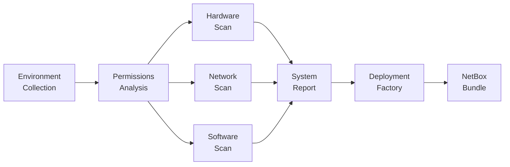

# Ultimate Info Gather

Welcome to the Ultimate Info Gather documentation!

**Ultimate Info Gather** is an async Python 3.11+ OOP framework for comprehensive system information collection, permission analysis, and hardware/software inventory.

## Features

<div class="grid cards" markdown>

-   :material-magnify:{ .lg .middle } **Environment Detection**

    ---

    Captures Python runtime, process info, and execution context

-   :material-lock:{ .lg .middle } **Permission Analysis**

    ---

    Determines permission levels, capabilities, and resource access

-   :material-memory:{ .lg .middle } **Hardware Inventory**

    ---

    Collects CPU, memory, storage, network, and GPU information

-   :material-lan:{ .lg .middle } **Network Analysis**

    ---

    Intensive in-depth network interfaces, routing, DNS, firewall, and connections

-   :material-package:{ .lg .middle } **Software Inventory**

    ---

    Catalogs OS, packages, services, containers, and processes

-   :material-server:{ .lg .middle } **NetBox Deployment Factory**

    ---

    Generates reproducible NetBox deployment bundles from collected system data

</div>

## Quick Example

```python
import asyncio
from src.orchestrator import InfoGatherOrchestrator

async def main():
    orchestrator = InfoGatherOrchestrator()
    report = await orchestrator.collect_all()
    print(report.get_full_summary())

asyncio.run(main())
```

## Collection Objectives

The framework is designed around four main objectives:

1. **Objective 1**: Collect current environment and determine running state
2. **Objective 2**: Determine permissions level and available resources
3. **Objective 3**: Collect all hardware/software and determine access levels
4. **Objective 4**: Generate comprehensive documentation

## Getting Started

Check out the [Installation Guide](getting-started/installation.md) to get started.

## Data Flow



## NetBox Deployment Factory

The [`netbox_deployment_factory`](guide/deployment-factory.md) subproject consumes system reports and generates production-ready NetBox deployment bundles including Docker Compose services, plugin configuration, Traefik TLS reverse proxy, monitoring stack, and identity integration. See the [Deployment Factory Guide](guide/deployment-factory.md) for details.

## Requirements

- Python 3.11 or higher
- Linux operating system
