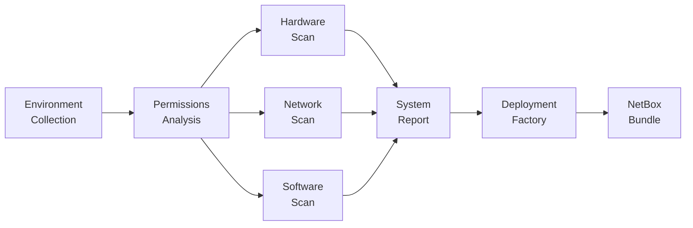

# Ultimate Info Gather

Welcome to the Ultimate Info Gather documentation!

**Ultimate Info Gather** is an async Python 3.11+ system inspection framework for environment, permissions, hardware, network, and software inventory, with an optional downstream NetBox deployment pipeline.

## Features

<div class="grid cards" markdown>

-   :material-magnify:{ .lg .middle } **Environment Detection**

    ---

    Captures Python runtime, process info, and execution context

-   :material-lock:{ .lg .middle } **Permission Analysis**

    ---

    Determines permission levels, capabilities, and resource access

-   :material-memory:{ .lg .middle } **Hardware Inventory**

    ---

    Collects CPU, memory, storage, network, and GPU information

-   :material-lan:{ .lg .middle } **Network Analysis**

    ---

    Intensive in-depth network interfaces, routing, DNS, firewall, and connections

-   :material-package:{ .lg .middle } **Software Inventory**

    ---

    Catalogs OS, packages, services, containers, and processes

-   :material-server:{ .lg .middle } **NetBox Deployment Factory**

    ---

    Generates reproducible NetBox deployment bundles from collected system data

</div>

## Quick Example

```python
import asyncio
from src.orchestrator import InfoGatherOrchestrator

async def main():
    orchestrator = InfoGatherOrchestrator()
    report = await orchestrator.collect_all()
    print(report.get_full_summary())

asyncio.run(main())
```

CLI usage from the repository root:

```bash
python3 main.py -o ./output -f json markdown
```

## Collection Objectives

The current codebase is organized around three collection phases plus reporting:

1. **Environment**: runtime, process, platform, execution context
2. **Permissions**: identity, groups, capabilities, file access, resource limits
3. **Hardware + Network + Software**: collected in parallel after permissions
4. **Reporting**: aggregate to `SystemReport` and emit JSON/Markdown/text

## Getting Started

Check out the [Installation Guide](getting-started/installation.md) to get started.

## Data Flow



## NetBox Deployment Factory

The [`netbox_deployment_factory`](factory/index.md) subproject consumes system reports and generates NetBox deployment bundles including Compose services, plugin configuration, Traefik, a WAF, monitoring, and optional identity services.

The repository has **two different CLIs** around this flow:

- the root deployment pipeline: `python3 -m src.deploy`
- the standalone factory package: Docker workflow or an installed `netbox-deployment-factory` command from the subproject

The factory pages document that distinction explicitly.

## Requirements

- Python 3.11 or higher
- Linux operating system
